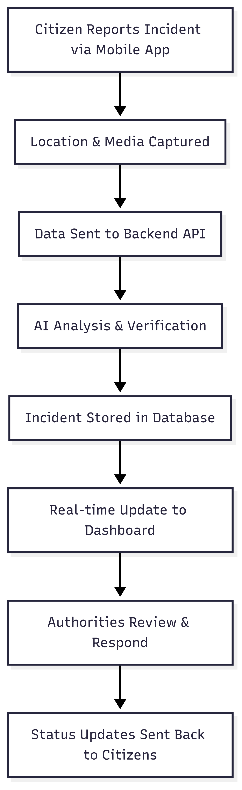

# Safe Egypt Pipeline Prototype 🇪🇬

**Report danger. Save lives. Protect Egypt.**

Safe Egypt is a comprehensive safety incident reporting system designed to help Egyptian citizens quickly and effectively report safety incidents to authorities. The system consists of three integrated components: a mobile app for citizens, a backend API for processing reports, and a dashboard for authorities to monitor and respond to incidents.

## 📱 Download the Mobile App

**[Download Safe Egypt APK (Android Only)](D:\projects\digitopia\Safe-Egypt-Demo\safe_egypt_v2\build\app\outputs\flutter-apk\app-release.apk)**

> **Note**: This application is currently available for Android devices only. The APK is a prototype version for testing and demonstration purposes.

## 🏗️ System Architecture

The Safe Egypt pipeline consists of three main components:

### 1. 📱 Mobile Application (`safe_egypt_v2/`)
- **Platform**: Flutter (Android)
- **Purpose**: Citizen incident reporting
- **Features**: 
  - Real-time incident reporting with multimedia evidence
  - GPS location tracking with Google Maps integration
  - Bilingual support (Arabic/English)
  - Anonymous reporting options

### 2. 🖥️ Backend API (`backend/`)
- **Platform**: FastAPI (Python)
- **Purpose**: Process and manage incident reports
- **Features**:
  - RESTful API endpoints for mobile and dashboard
  - AI-powered incident verification and analysis
  - Media file processing (images, videos, audio)
  - Location services and geocoding
  - Real-time data synchronization

### 3. 📊 Authority Dashboard (`dashboard/`)
- **Platform**: React with TypeScript
- **Purpose**: **FOR AUTHORITIES ONLY** - Monitor and respond to incidents
- **Features**:
  - Real-time incident monitoring and management
  - Interactive map with incident locations
  - Priority-based alert system
  - Analytics and reporting tools
  - Multi-language support (Arabic/English)

> ⚠️ **IMPORTANT**: The dashboard is restricted to authorized personnel only (police, emergency services, government officials). It contains sensitive information and should not be accessed by civilians.

## 🔄 How the Pipeline Works




1. **Incident Reporting**: Citizens use the mobile app to report incidents with photos, videos, and location data
2. **AI Processing**: The backend uses AI to analyze and verify incident reports for accuracy and urgency
3. **Authority Notification**: Verified incidents are immediately displayed on the authority dashboard
4. **Response Coordination**: Authorities can assign priority levels, dispatch resources, and update incident status
5. **Citizen Updates**: Status updates are sent back to citizens who reported the incidents

## 📋 Prerequisites

Before setting up the Safe Egypt pipeline, ensure you have:

### System Requirements
- **Windows 10/11** (tested environment)
- **Node.js 18+** and npm
- **Python 3.8+** and pip
- **Flutter SDK 3.9.2+**
- **Android Studio** (for mobile development)

### API Keys Required
- **Google Maps API Key** (for location services)
- **Google Gemini API Key** (for AI analysis)

## 🚀 Installation Guide

### Step 1: Clone the Repository
```bash
git clone https://github.com/your-username/safe-egypt-pipeline.git
cd safe-egypt-pipeline
```

### Step 2: Setup Backend API
```bash
# Navigate to backend directory
cd backend

# Create virtual environment
python -m venv venv
venv\Scripts\activate  # On Windows
# source venv/bin/activate  # On Linux/Mac

# Install dependencies
pip install -r requirements.txt

# Create .env file with your API keys
echo "GOOGLE_API_KEY=your_google_maps_api_key" > .env
echo "GEMINI_API_KEY=your_gemini_api_key" >> .env

# Start the backend server
python app.py
```

The backend will be available at `http://localhost:8000`

#### Using ngrok for External Access
To make your backend accessible from mobile devices or external networks, use ngrok:

```bash
# Install ngrok (if not already installed)
# Download from https://ngrok.com/

# In a new terminal, expose your local backend
ngrok http 8000
```

This will provide you with a public URL (e.g., `https://abc123.ngrok.io`) that you can use to access your backend from anywhere.

### Step 3: Setup Authority Dashboard
```bash
# Navigate to dashboard directory
cd dashboard/aman-alwatan-al-aan

# Install dependencies
npm install

# Create .env file for dashboard configuration
echo "VITE_API_BASE_URL=http://localhost:8000" > .env
echo "VITE_GOOGLE_MAPS_API_KEY=your_google_maps_api_key" >> .env

# Start the development server
npm run dev
```

The dashboard will be available at `http://localhost:5173`

### Step 4: Setup Mobile Application
```bash
# Navigate to mobile app directory
cd safe_egypt_v2

# Install Flutter dependencies
flutter pub get

# Configure Google Maps API key
# Edit android/app/src/main/AndroidManifest.xml
# Add your Google Maps API key

# Run the application (with backend running)
flutter run
```

Or simply install the pre-built APK on your Android device.

## 📱 Mobile App Usage Guide

### For Citizens:

1. **Download and Install**
   - Download the APK file from the link above
   - Enable "Install from Unknown Sources" in Android settings
   - Install the application

2. **First Time Setup**
   - Grant location permissions when prompted
   - Grant camera and storage permissions
   - Choose your preferred language (Arabic/English)

3. **Reporting an Incident**
   - Open the app and tap "Report Incident"
   - Select incident type from the list
   - Add description of what happened
   - Take photos or videos as evidence
   - Your location will be automatically detected
   - Choose whether to report anonymously
   - Tap "Submit Report"

4. **Track Your Reports**
   - View your submitted reports in the app
   - Check status updates from authorities
   - Receive notifications about your reports

## 🖥️ Dashboard Usage Guide

### For Authorities Only:

1. **Access the Dashboard**
   - Navigate to `http://localhost:5173` (or deployed URL)
   - Login with authorized credentials
   - Select your preferred language

2. **Monitor Incidents**
   - View real-time incident feed on the main dashboard
   - Use the interactive map to see incident locations
   - Filter incidents by type, severity, or status

3. **Respond to Incidents**
   - Click on any incident to view full details
   - Assign priority levels (High/Medium/Low)
   - Update incident status (Pending/Reviewed/Resolved)
   - Add internal notes and response actions

4. **Analytics and Reporting**
   - View incident statistics and trends
   - Generate reports for specific time periods
   - Export data for further analysis

## 🔧 Configuration

### Backend Configuration
Edit `backend/app.py` to modify:
- API endpoints and routes
- CORS settings for different origins
- Upload directory paths
- Server host and port settings

### Mobile App Configuration
Edit `safe_egypt_v2/lib/services/api_service.dart` to modify:
- Backend API base URL (use your ngrok URL for external access)
- Request timeout settings
- File upload limits

**For ngrok usage**: Replace the base URL in `api_service.dart` with your ngrok URL:
```dart
static const String baseUrl = 'https://your-ngrok-url.ngrok.io';
```

### Dashboard Configuration
Edit `dashboard/aman-alwatan-al-aan/src/lib/api.ts` to modify:
- API endpoints (use your ngrok URL for external access)
- Polling intervals for real-time updates
- Map settings and styles

**For ngrok usage**: Update the dashboard's `.env` file with your ngrok URL:
```bash
echo "VITE_API_BASE_URL=https://your-ngrok-url.ngrok.io" > .env
```

## 🛠️ Development

### Backend Development
```bash
cd backend
# Install development dependencies
pip install -r requirements.txt

# Run with auto-reload
uvicorn app:app --reload --host 0.0.0.0 --port 8000
```

### Dashboard Development
```bash
cd dashboard/aman-alwatan-al-aan
# Install dependencies
npm install

# Start development server with hot reload
npm run dev
```

### Mobile App Development
```bash
cd safe_egypt_v2
# Install dependencies
flutter pub get

# Run in debug mode with hot reload
flutter run --debug
```

## 🔒 Security & Privacy

- **Data Encryption**: All data transmission is encrypted using HTTPS
- **Anonymous Reporting**: Citizens can report incidents without revealing their identity
- **Access Control**: Dashboard access is restricted to authorized personnel only
- **Data Retention**: Incident data is retained according to government policies
- **Privacy Protection**: Personal information is handled according to privacy regulations

## 🌍 Localization

The system supports:
- **Arabic (Egypt)** - Native language with RTL layout support
- **English (US)** - International language support

Translation files are located in:
- Mobile: `safe_egypt_v2/lib/assets/translations/`
- Dashboard: `dashboard/aman-alwatan-al-aan/src/locales/`

## 📊 API Documentation

### Mobile Endpoints
- `POST /api/mobile/upload-media` - Submit incident report with media
- `GET /api/mobile/incidents/formatted` - Get formatted incidents for display
- `GET /api/mobile/location/{lat}/{lng}` - Get location name for coordinates
- `GET /api/mobile/health` - Health check endpoint

### Dashboard Endpoints
- `GET /api/dashboard/incidents` - Get all incidents with filtering
- `PUT /api/dashboard/incidents/{id}` - Update incident status
- `GET /api/dashboard/analytics` - Get incident analytics data

Full API documentation is available at `http://localhost:8000/docs` when the backend is running locally, or at `https://your-ngrok-url.ngrok.io/docs` when using ngrok.

## 🚨 Emergency Contacts

In case of immediate emergency, always call:
- **Police**: 122
- **Ambulance**: 123
- **Fire Department**: 180
- **Tourist Police**: 126

This app is designed to supplement, not replace, emergency services.

## 🤝 Contributing

This is a safety-critical application. If you'd like to contribute:

1. Fork the repository
2. Create a feature branch (`git checkout -b feature/safety-improvement`)
3. Commit your changes (`git commit -m 'Add safety improvement'`)
4. Push to the branch (`git push origin feature/safety-improvement`)
5. Open a Pull Request

## 📄 License

This project is proprietary software developed for Egyptian authorities. All rights reserved.

## 📞 Support & Contact

For technical support, bug reports, or feature requests:
- **Email**: support@safe-egypt.gov.eg
- **Phone**: +20 2 XXXX-XXXX
- **Emergency Technical Issues**: Available 24/7

## ⚠️ Disclaimer

This is a prototype system for demonstration purposes. While functional, it should be thoroughly tested and reviewed before deployment in production environments. The system is designed to assist emergency response but should not be the sole method of emergency communication.

---

**Safe Egypt Pipeline** - Making Egypt safer, one report at a time. 🛡️🇪🇬

*Built with ❤️ for the safety and security of all Egyptians*
